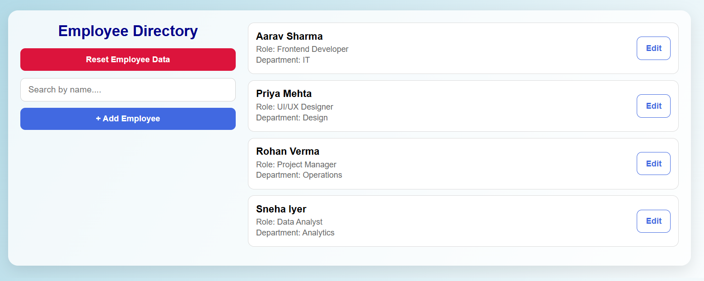
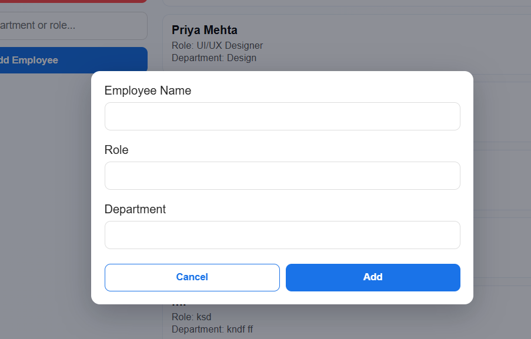
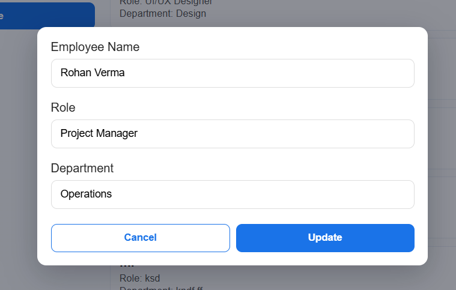
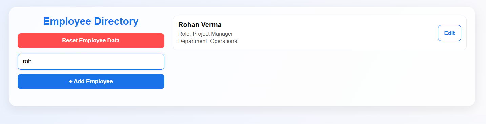
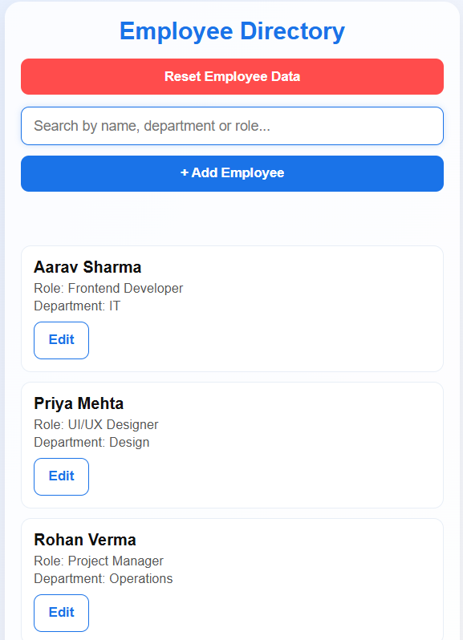

# Employee Directory (React + Vite)

This project is a responsive Employee Directory Management System built using React and Vite.  
Developed by **Vishesh Verma**, it provides an intuitive interface to manage employee records, allowing users to add, edit, search, and reset employee data.  
The application stores data locally using the browser's LocalStorage for persistence and offers a smooth experience on both desktop and mobile devices.

---

## Technologies Used

- **Frontend:** React (Vite)
- **Styling:** CSS (custom responsive design)
- **State Management:** React Hooks (useState)
- **Data Storage:** Browser LocalStorage

---

## Features

1. **Add Employee**  
   Add new employee details such as name, role, and department.

2. **Edit Employee**  
   Update existing employee information directly from the list.

3. **Search Functionality**  
   Search employees by their name (case-insensitive).

4. **Persistent Data**  
   Employee data remains saved in LocalStorage even after page refresh.

5. **Reset Functionality**  
   A reset button allows the user to clear LocalStorage and reload default data.

6. **Responsive Design**  
   Works seamlessly across mobile, tablet, and desktop screens.

---

## Default Employee Data

| ID | Name          | Role                | Department  |
|----|----------------|--------------------|--------------|
| 1  | Aarav Sharma   | Frontend Developer | IT           |
| 2  | Priya Mehta    | UI/UX Designer     | Design       |
| 3  | Rohan Verma    | Project Manager    | Operations   |
| 4  | Sneha Iyer     | Data Analyst       | Analytics    |

---

## Screenshots

### Home Page

### Add Employee

### Edit Employee

### Search Employee

### Mobile View

---

## Future Improvements

- Add user authentication and role-based access  
- Connect with a backend using Node.js and MongoDB  
- Create a dashboard with employee statistics and charts  
- Export employee data to Excel or PDF  
- Integrate AI-based employee analysis in the future  

---

## Developer Information

**Name:** Vishesh Verma  
**Degree:** B.Tech in Computer Science  
**Specialization:** Full Stack MERN Development  
**Project Type:** Assignment
**Purpose:** Demonstration of React-based CRUD operations with LocalStorage persistence | Assignment Penthara

---
